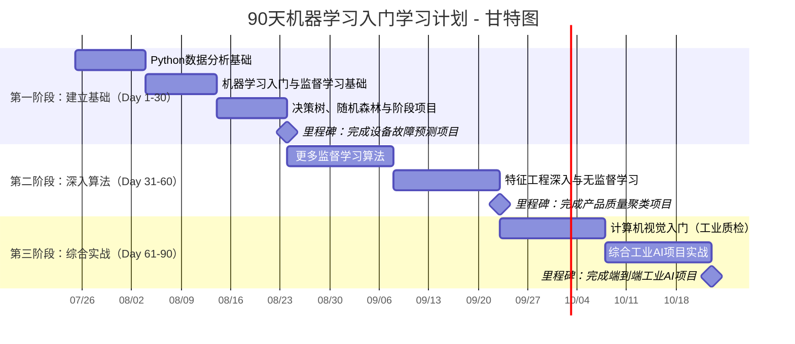

# 90天机器学习入门学习计划（工业AI导向）

> **适用人群**：希望成为工业AI复合型人才的入门者  
> **每日投入**：约1小时（30分钟学理论 + 30分钟写代码/练习）  
> **学习周期**：90天（约3个月）  
> **难度定位**：适中，不追求数学推导，先建立直觉理解  
> **核心目标**：掌握监督学习、无监督学习、特征工程、模型评估，能独立完成工业场景AI项目

---

## 一、学习路线图（甘特图）



---

## 二、总体设计原则

| 原则 | 说明 |
|------|------|
| **循序渐进** | 先懂概念 → 再写代码 → 最后做项目，不跳步 |
| **工业导向** | 每个知识点都用工业场景举例，学完就能用 |
| **每天1小时** | 30分钟学理论/视频 + 30分钟写代码/练习 |
| **不追求数学推导** | 先建立直觉理解，数学细节后续补充 |
| **边学边做** | 每阶段结束都有一个小项目 |

---

## 三、第一阶段（第1-30天）：建立直觉 + Python数据分析基础

### 3.1 第1-10天：Python数据分析基础

> **核心目标**：能用Python处理工厂生产数据，做基本的数据分析和可视化

| 天数 | 学习内容 | 工业场景举例 | 推荐资源 | 每日时间分配 |
|------|---------|------------|---------|------------|
| Day 1-2 | Python基础语法（变量、列表、字典、循环、函数） | 读取设备传感器数据列表，遍历产线设备编号 | 《Python编程：从入门到实践》第1-6章 | 理论20min + 代码40min |
| Day 3-4 | NumPy数组操作 | 处理批量传感器读数（温度、压力数组），计算产线平均值 | NumPy官方100题（前30题） | 理论20min + 代码40min |
| Day 5-7 | Pandas数据处理（读取CSV、筛选、分组、聚合） | 分析工厂生产报表：按产线统计产量、按班次统计良品率 | Kaggle "Pandas"微课程（免费） | 理论20min + 代码40min |
| Day 8-10 | Matplotlib/Seaborn可视化 | 绘制设备温度趋势图、产线良品率柱状图、缺陷分布饼图 | Kaggle "Data Visualization"微课程 | 理论20min + 代码40min |

**阶段检查点**：

- [x] 能用Pandas读取CSV文件并进行筛选、分组、聚合
- [x] 能用Matplotlib画出温度随时间变化的趋势图
- [x] 理解DataFrame和Series的基本操作

---

### 3.2 第11-20天：机器学习入门 + 监督学习基础

> **核心目标**：理解机器学习基本概念，掌握**线性回归、逻辑回归和模型评估**

| 天数 | 学习内容 | 工业场景举例 | 推荐资源 | 每日时间分配 |
|------|---------|------------|---------|------------|
| Day 11-12 | 机器学习是什么？监督 vs 无监督 vs 强化学习 | 监督=预测设备故障；无监督=发现异常生产模式；强化学习=机器人路径优化 | 吴恩达《机器学习》Coursera（第1-2周，只看视频不做题） | 理论30min + 代码30min |
| Day 13-14 | 线性回归：用直线拟合数据 | 根据电机转速预测功耗；根据温度预测产品良率 | 吴恩达第3-4周（线性回归部分） | 理论30min + 代码30min |
| Day 15-16 | 逻辑回归：二分类问题 | 判断产品是否合格（合格/不合格）；判断设备是否将故障 | 吴恩达第5-6周（分类部分） | 理论30min + 代码30min |
| Day 17-18 | 模型评估指标：准确率、精确率、召回率、F1、混淆矩阵 | 质检模型：宁可错杀不可漏检（追求高召回）；故障预测：避免漏报 | 吴恩达第7周 + 自己画混淆矩阵 | 理论30min + 代码30min |
| Day 19-20 | 过拟合与欠拟合、训练集/验证集/测试集划分 | 模型在训练数据上表现好，但在新设备上预测差（过拟合） | 吴恩达第8周 | 理论30min + 代码30min |

**阶段检查点**：

- [x] Scikit-learn基础学习
- [x] 能用Scikit-learn训练一个**线性回归**模型
- [x] 能用Scikit-learn训练一个**分类回归**模型
- [x] 能理解并计算准确率、精确率、召回率
- [x] 能画出训练集和测试集的学习曲线，判断是否过拟合
- [x] 其他激活函数的基本原理

---

### 3.3 第21-30天：决策树与随机森林 + 阶段项目

> **核心目标**：掌握树模型，完成第一个工业AI项目

| 天数 | 学习内容 | 工业场景举例 | 推荐资源 | 每日时间分配 |
|------|---------|------------|---------|------------|
| Day 21-23 | 决策树：用"如果-那么"规则做分类 | 如果温度>80且振动>5，则设备即将故障；如果表面粗糙度>阈值，则产品不合格 | 《Hands-On Machine Learning》第6章 | 理论30min + 代码30min |
| Day 24-26 | 随机森林：多棵决策树投票 | 综合温度、压力、电流、振动等多维特征预测故障类型 | 《Hands-On Machine Learning》第7章 | 理论30min + 代码30min |
| Day 27-28 | 特征工程基础：标准化、归一化、缺失值处理 | 不同量纲的数据（温度°C vs 压力MPa）需要统一缩放；传感器数据缺失时如何处理 | Kaggle "Feature Engineering"微课程（前3节） | 理论30min + 代码30min |
| Day 29-30 | **阶段项目：设备故障预测** | 用随机森林预测设备是否故障，计算准确率、召回率，对比线性回归和随机森林 | UCI "AI4I 2020 Predictive Maintenance"数据集 | 全天做项目 |

**第一阶段项目：设备故障预测**

- **数据集**：UCI Predictive Maintenance Dataset（免费公开）
- **任务**：根据设备温度、转速、扭矩、磨损等特征，预测设备是否会发生故障
- **要求**：
  - 数据探索（查看数据分布、缺失值）
  - 特征标准化
  - 训练至少2个模型（逻辑回归 + 随机森林）
  - 计算准确率、精确率、召回率、F1
  - 画出混淆矩阵
  - 分析特征重要性（哪个传感器最重要？）
- **产出**：一份完整的Jupyter Notebook

---

## 四、第二阶段（第31-60天）：深入监督学习 + 特征工程实战

### 4.1 第31-45天：更多监督学习算法

> **核心目标**：扩展算法工具箱，掌握集成学习和模型调优

| 天数 | 学习内容 | 工业场景举例 | 推荐资源 | 每日时间分配 |
|------|---------|------------|---------|------------|
| Day 31-33 | K近邻（KNN）：找最相似的样本 | 根据历史相似工况预测当前设备状态；根据相似产品参数预测质量等级 | 《Hands-On Machine Learning》第3章 | 理论30min + 代码30min |
| Day 34-36 | 支持向量机（SVM）：找最优分界线 | 区分正常产品和缺陷产品；二分类问题的高维映射 | 吴恩达第12周（SVM部分，可选看） | 理论30min + 代码30min |
| Day 37-39 | XGBoost/LightGBM：梯度提升树 | 工业竞赛中最常用的算法，精度高；Kaggle工业比赛的标配 | Kaggle "Intro to Machine Learning"（XGBoost部分） | 理论30min + 代码30min |
| Day 40-42 | 交叉验证：K-Fold评估模型稳定性 | 确保模型在不同时间段的数据上都表现好（避免时序数据泄露） | Scikit-learn官方文档（Cross-validation） | 理论30min + 代码30min |
| Day 43-45 | 超参数调优：Grid Search、Random Search | 找到随机森林的最佳树数量和深度；找到XGBoost的最佳学习率 | Scikit-learn官方文档（GridSearchCV） | 理论30min + 代码30min |

**阶段检查点**：
- [ ] 能用XGBoost训练模型，并与随机森林对比效果
- [ ] 能用交叉验证评估模型稳定性
- [ ] 能用GridSearchCV做超参数调优

---

### 4.2 第46-60天：特征工程深入 + 无监督学习入门

> **核心目标**：掌握特征工程的核心技术，理解无监督学习的价值

| 天数 | 学习内容 | 工业场景举例 | 推荐资源 | 每日时间分配 |
|------|---------|------------|---------|------------|
| Day 46-48 | 特征选择：筛选重要特征 | 从20个传感器中找出真正影响故障的5个；去除冗余特征 | Scikit-learn（SelectKBest、RFE） | 理论30min + 代码30min |
| Day 49-51 | 特征构造：从原始数据创造新特征 | 从"温度"和"时间"构造"温升速率"；从"电流"构造"功率波动幅度" | Kaggle "Feature Engineering"（后3节） | 理论30min + 代码30min |
| Day 52-54 | K-Means聚类：发现数据中的自然分组 | 无标签情况下发现设备的异常运行模式；将产品按质量特征自动分组 | 吴恩达第13周（聚类部分） | 理论30min + 代码30min |
| Day 55-57 | PCA降维：减少特征数量同时保留信息 | 传感器太多（50个），降到10个关键指标用于可视化；去除多重共线性 | 吴恩达第14周（PCA部分） | 理论30min + 代码30min |
| Day 58-60 | **阶段项目：产品质量聚类分析** | 用K-Means对无标签的产品数据进行聚类，发现隐藏的质量模式；用PCA降维后可视化 | Kaggle "Steel Plate Fault Detection"数据集 | 全天做项目 |

**第二阶段项目：产品质量聚类分析**

- **数据集**：Kaggle Steel Plate Fault Detection（或自建工厂数据）
- **任务**：对没有标签的产品数据进行聚类，发现隐藏的质量模式
- **要求**：
  - 数据标准化
  - 用肘部法则确定最佳聚类数K
  - 用K-Means聚类并分析每个簇的特征
  - 用PCA降到2维/3维并可视化聚类结果
  - 解释每个簇代表什么质量模式
- **产出**：一份完整的Jupyter Notebook + 聚类结果解读

---

## 五、第三阶段（第61-90天）：综合实战 + 工业场景项目

### 5.1 第61-75天：计算机视觉入门（工业质检方向）

> **核心目标**：理解图像处理基础，能做一个简单的工业缺陷检测模型

| 天数 | 学习内容 | 工业场景举例 | 推荐资源 | 每日时间分配 |
|------|---------|------------|---------|------------|
| Day 61-63 | 图像基础：OpenCV读取、裁剪、滤波 | 读取工业相机拍摄的零件照片；去除噪点；调整亮度和对比度 | OpenCV官方Python教程（前10章） | 理论30min + 代码30min |
| Day 64-66 | 传统图像处理：边缘检测、阈值分割、形态学操作 | 检测零件轮廓判断是否有缺损；分割出产品区域进行测量 | OpenCV教程（Canny边缘检测、Otsu阈值） | 理论30min + 代码30min |
| Day 67-70 | 深度学习入门：神经网络基础、CNN原理 | 用简单的CNN做二分类（良品/不良品）；理解卷积、池化、全连接层 | 吴恩达《深度学习》第1-2周（可选，只看概念） | 理论30min + 代码30min |
| Day 71-73 | 迁移学习：用预训练模型做工业质检 | 用ResNet/VGG做零件缺陷检测，只需少量标注数据；快速落地AI质检 | PyTorch官方迁移学习教程 | 理论30min + 代码30min |
| Day 74-75 | 模型评估：mAP、IoU、混淆矩阵 | 质检模型：漏检1个不良品比误判10个良品更危险（高召回优先） | 目标检测评估指标教程 | 理论30min + 代码30min |

**阶段检查点**：
- [ ] 能用OpenCV读取图像并进行基本处理
- [ ] 理解CNN的基本结构和工作原理
- [ ] 能用迁移学习训练一个图像分类模型

---

### 5.2 第76-90天：综合工业AI项目

> **核心目标**：独立完成一个端到端的工业AI项目

| 天数 | 学习内容 | 任务 | 每日时间分配 |
|------|---------|------|------------|
| Day 76-78 | 项目选题与数据准备 | 从三个选项中选择一个项目，获取数据，做数据探索 | 全天做项目 |
| Day 79-82 | 特征工程与模型训练 | 数据清洗、特征构造、训练多个模型、交叉验证 | 全天做项目 |
| Day 83-86 | 模型评估与优化 | 计算评估指标、超参数调优、特征重要性分析 | 全天做项目 |
| Day 87-90 | 项目总结与展示 | 写项目报告、整理Notebook、准备演示 | 全天做项目 |

**最终项目：端到端工业AI项目（三选一）**

| 项目选项 | 难度 | 数据来源 | 核心任务 | 产出要求 |
|---------|------|---------|---------|---------|
| **A. 设备故障预测** | ⭐⭐⭐ | UCI Predictive Maintenance | 完整pipeline：数据清洗→特征工程→模型训练→评估→部署建议 | 1. Jupyter Notebook<br>2. 特征重要性分析<br>3. 至少2种算法对比<br>4. 项目总结报告 |
| **B. 产品缺陷检测** | ⭐⭐⭐⭐ | Kaggle MVTec AD / 自建 | 用CNN做图像分类，计算准确率、召回率 | 1. Jupyter Notebook<br>2. 混淆矩阵分析<br>3. 错误样本分析<br>4. 项目总结报告 |
| **C. 产线产量预测** | ⭐⭐⭐ | 自建或公开时序数据 | 用XGBoost/LightGBM预测明天产量，评估MAE/RMSE | 1. Jupyter Notebook<br>2. 时序特征工程<br>3. 预测结果可视化<br>4. 项目总结报告 |

---

## 六、推荐学习资源汇总

### 6.1 视频课程（免费/低成本）

| 资源 | 适合阶段 | 说明 | 链接 |
|------|---------|------|------|
| **吴恩达《机器学习》Coursera** | 全程 | 经典入门课，概念讲解清晰，数学要求不高 | coursera.org/learn/machine-learning |
| **Kaggle Learn微课程** | 第1-2阶段 | 免费，边学边做，每节10-15分钟 | kaggle.com/learn |
| **StatQuest with Josh Starmer** | 全程 | 用动画讲清复杂概念，非常推荐！ | youtube.com/@statquest |
| **李宏毅《机器学习》B站** | 第2-3阶段 | 中文，幽默易懂，适合有基础后看 | B站搜索"李宏毅 机器学习" |
| **吴恩达《深度学习》Coursera** | 第3阶段 | 深度学习专项课程，可选看 | coursera.org/specializations/deep-learning |

### 6.2 书籍

| 书籍 | 适合阶段 | 说明 |
|------|---------|------|
| **《Python编程：从入门到实践》** | 第1阶段 | Python零基础必读，Eric Matthes著 |
| **《Hands-On Machine Learning》（机器学习实战）** | 全程 | 工业界圣经，Aurelien Geron著，代码可直接跑 |
| **《Python数据分析》** | 第1阶段 | Pandas权威指南，Wes McKinney著 |
| **《机器学习》** | 第2阶段 | 中文经典教材，周志华著（"西瓜书"）|

### 6.3 练习平台与数据集

| 平台/数据集 | 用途 | 说明 |
|------------|------|------|
| **Kaggle** | 数据集+竞赛+微课程 | 工业数据集丰富，Notebook可直接运行 |
| **LeetCode（简单题）** | Python编程练习 | 每天1-2题，保持编程手感 |
| **Scikit-learn官方文档** | API查阅+示例 | 最好的参考手册，示例代码可直接复制 |
| **UCI Machine Learning Repository** | 公开数据集 | 包含大量工业相关数据集 |
| **MVTec AD Dataset** | 工业缺陷检测 | 工业质检的经典数据集 |

---

## 七、90天学习日历速查表

```
┌─────────────────────────────────────────────────────────────────────────┐
│                        90天机器学习入门学习计划                            │
├──────────────┬──────────────────────────────────────────────────────────┤
│  第1-30天    │ 【第一阶段：建立基础】                                    │
│              │ Week 1-2: Python + NumPy + Pandas                       │
│              │ Week 3-4: 机器学习概念 + 线性/逻辑回归 + 模型评估         │
│              │ Week 5: 决策树 + 随机森林                                │
│              │ Week 6: 特征工程基础 + 项目1（设备故障预测）              │
├──────────────┼──────────────────────────────────────────────────────────┤
│  第31-60天   │ 【第二阶段：深入算法】                                    │
│              │ Week 7-8: KNN + SVM + XGBoost + 交叉验证                 │
│              │ Week 9: 超参数调优 + 特征工程深入                         │
│              │ Week 10: K-Means聚类 + PCA降维                           │
│              │ Week 11-12: 项目2（产品质量聚类/特征工程实战）            │
├──────────────┼──────────────────────────────────────────────────────────┤
│  第61-90天   │ 【第三阶段：综合实战】                                    │
│              │ Week 13-14: OpenCV图像处理 + CNN基础                     │
│              │ Week 15: 迁移学习 + 模型评估（mAP/IoU）                   │
│              │ Week 16-18: 最终项目（故障预测/缺陷检测/产量预测）        │
└──────────────┴──────────────────────────────────────────────────────────┘
```

---

## 八、关键心态建议

| 建议 | 原因 |
|------|------|
| **不要追求完美理解** | 先跑通代码看到结果，再回头理解原理。机器学习中"先用起来"比"完全搞懂"更重要 |
| **遇到报错先Google** | 90%的错误别人也遇到过，Stack Overflow和GitHub Issues有答案 |
| **加入学习社群** | Kaggle论坛、机器学习微信群、知乎专栏，遇到问题有人帮 |
| **每周末复盘** | 回顾这周学了什么，哪些地方还不懂，下周重点攻克 |
| **用工业数据练手** | 不要只用Iris、MNIST，去找工厂真实数据集，培养工业直觉 |
| **坚持90天** | 机器学习的门槛不在难度，而在持续投入。每天1小时，90天就是90小时 |

---

## 九、里程碑检查清单

### 第一阶段里程碑（Day 30）

- [ ] 能用Pandas读取CSV并进行筛选、分组、聚合
- [ ] 能用Matplotlib/Seaborn画出数据可视化图表
- [ ] 能用Scikit-learn训练线性回归和逻辑回归模型
- [ ] 能计算并解释准确率、精确率、召回率、F1
- [ ] 能用随机森林做分类，并分析特征重要性
- [ ] **完成项目1：设备故障预测**

### 第二阶段里程碑（Day 60）

- [ ] 能用XGBoost训练模型，并与其他算法对比
- [ ] 能用交叉验证评估模型稳定性
- [ ] 能用GridSearchCV做超参数调优
- [ ] 能做特征选择（SelectKBest、RFE）
- [ ] 能用K-Means聚类并解释聚类结果
- [ ] 能用PCA降维并可视化
- [ ] **完成项目2：产品质量聚类分析**

### 第三阶段里程碑（Day 90）

- [ ] 能用OpenCV进行基本图像处理
- [ ] 理解CNN的基本结构和工作原理
- [ ] 能用迁移学习训练图像分类模型
- [ ] 能独立完成一个端到端的工业AI项目
- [ ] 能写项目报告，清晰阐述问题→方法→结果→改进方向
- [ ] **完成最终项目：故障预测/缺陷检测/产量预测（三选一）**

---

> **最重要的建议**：坚持90天，每天1小时。90天后，你将具备独立解决工业场景中基础AI问题的能力。如果在学习过程中遇到具体的技术问题，随时可以进一步交流！


# 部分指令

```bash
conda activate ml-industrial
jupyter lab --no-browser
```


